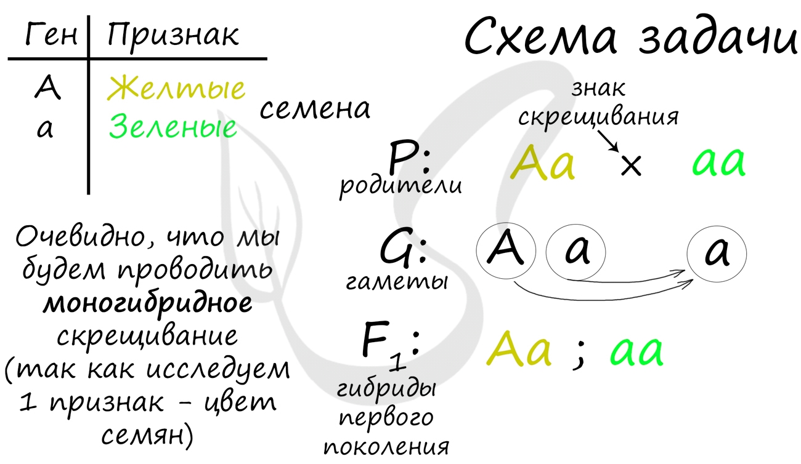

Законы основанные одним из самых больших отцов генетики – Менделем, когда он пытался найти закономерности при [скрещивании](Скрещивание.md) гороха

## Первый закон Менделя – Единообразие
С него часто начинаются [генетические задачи](СхемаГенетическойЗадачи.png) (в качестве первого скрещивания). Этот закон гласит о том, что при скрещивании [гомозиготных](Ген.md) особей, отличающихся одной или несколькими парами альтернативных [признаков](Признак.md), все гибриды первого поколения будут единообразны по данным признакам.

Этот закон основан на варианте взаимодействия между генами - полном доминировании. При таком варианте один ген - доминантный, полностью подавляет другой ген - рецессивный.

## Второй закон Менделя – Расщепление

"При скрещивании гетерозиготных гибридов (Aa) первого поколения F1 во втором поколении F2 наблюдается расщепление по данному признаку: по генотипу 1 : 2 : 1, по фенотипу 3 : 1"

> [!WARNING] Маленькое пояснение по расщеплению
> Это исходит их того что если построить [решетку Пеннета](Решетка%20Пеннета.md), то например по примеру внизу, получится по генотипу – 2 Аа и 2 аа, а вот по фенотипу – примерно также, 2 карих и 2 голубых. Также и сверху с горохами.
> 
> 
> 
> 

## Третий закон Менделя – Независимое наследование
Тут речь идет о дигибридном скрещивании.
Важно заметить, что речь в данном законе идет о генах, которые расположены в разных хромосомах.

> [!QUOTE]
> "При скрещивании особей, отличающихся друг от друга по двум (и более) парам альтернативных признаков, гены и соответствующие им признаки наследуются независимо друг от друга, комбинируясь друг с другом во всех возможных сочетаниях".

Комбинации генов отражаются в образовании гамет. В соответствии с правилом, изложенным выше, дигетерозигота AaBb образует 4 типа гамет: AB, ab, Ab, aB. Повторюсь - это только если гены находятся в разных хромосомах. Если они находятся в одной, как при сцепленном наследовании, то все протекает по-другому, но это уже предмет изучения следующей статьи.

Каждая особь AaBb образует 4 типа гамет, возможных гибридов второго поколения получается 16. При таком обилии гамет и большом количестве потомков, разумнее использовать решетку Пеннета, в которой вдоль одной стороны квадрата расположены мужские гаметы, а вдоль другой - женские. Это помогает более наглядно представить генотипы, получающиеся в результате скрещивания.

В результате скрещивания дигетерозигот среди 16 потомков получается 4 возможных фенотипа:

- Желтые гладкие - 9
- Желтые морщинистые - 3
- Зеленые гладкие - 3
- Зеленые морщинистые - 1

Очевидно, что расщепление по фенотипу среди гибридов второго поколения составляет: 9:3:3:1.